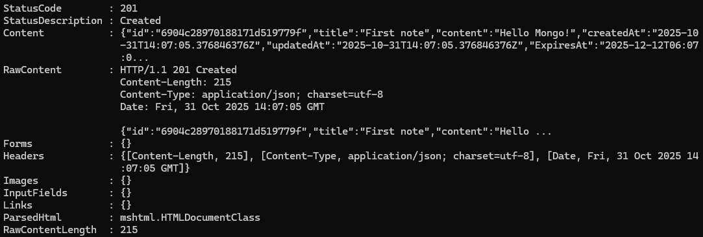
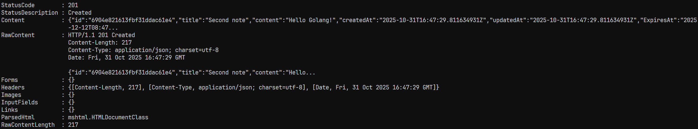
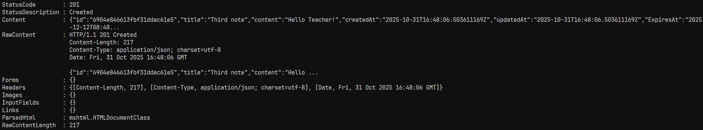
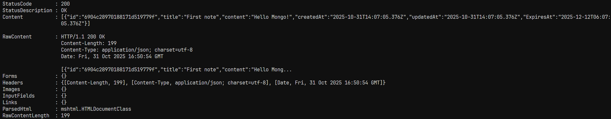
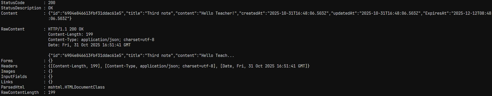
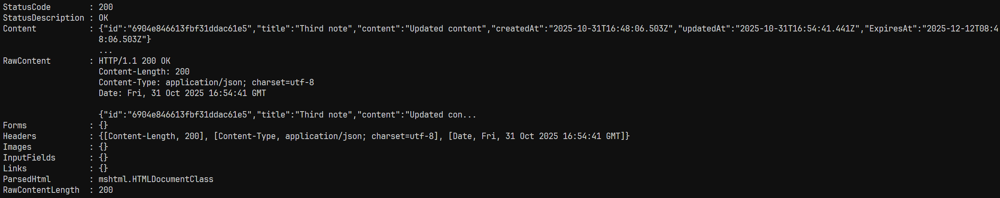
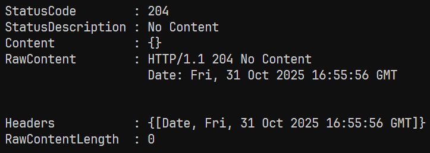
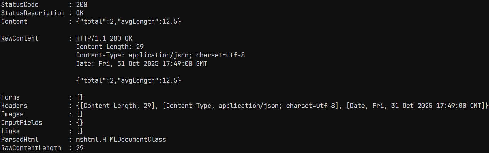

# Практическая работа № 8
Студент: Юркин В.И.
Группа: ПИМО-01-25

Тема: Работа с MongoDB: подключение, создание коллекции, CRUD-операции

Цели:
- Понять базовые принципы документной БД MongoDB (документ, коллекция, BSON, _id:ObjectID).
- Научиться подключаться к MongoDB из Go с использованием официального драйвера.
- Создать коллекцию, индексы и реализовать CRUD для одной сущности (например, notes).
- Отработать фильтрацию, пагинацию, обновления (в т.ч. частичные), удаление и обработку ошибок.

## Примеры кода
Создание текстового индекса
```
	_, errTitleIndex := col.Indexes().CreateOne(context.Background(), mongo.IndexModel{
		Keys:    bson.D{{Key: "title", Value: "text"}},
		Options: options.Index(),
	})
```

Создание TTL-индекса
```
	_, errExpirationIndex := col.Indexes().CreateOne(context.Background(), mongo.IndexModel{
		Keys:    bson.D{{Key: "expiresAt", Value: 1}},
		Options: options.Index().SetExpireAfterSeconds(0),
	})
```

Получение статистики (агрегирующий запрос)
```
func (r *Repo) Stats(ctx context.Context) (*NoteStats, error) {
	pipeline := mongo.Pipeline{
		{{Key: "$group", Value: bson.D{
			{Key: "_id", Value: nil},
			{Key: "total", Value: bson.D{{Key: "$sum", Value: 1}}},
			{Key: "avgLength", Value: bson.D{{Key: "$avg", Value: bson.D{{Key: "$strLenCP", Value: "$content"}}}}},
		}}},
	}

	cur, err := r.col.Aggregate(ctx, pipeline)
	if err != nil {
		return nil, err
	}
	defer cur.Close(ctx)

	var results []NoteStats
	if err := cur.All(ctx, &results); err != nil {
		return nil, err
	}

	if len(results) == 0 {
		return &NoteStats{Total: 0, AvgLength: 0}, nil
	}

	return &results[0], nil
}
```

## Скриншоты (Windows 11)

### 1. Создание заметки
```bash
curl -Method POST http://localhost:8080/api/v1/notes `
   -ContentType "application/json" `
   -Body '{"title":"First note","content":"Hello Mongo!"}'
```
```bash
curl -Method POST http://localhost:8080/api/v1/notes `
   -ContentType "application/json" `
   -Body '{"title":"Second note","content":"Hello Golang!"}'
```
```bash
curl -Method POST http://localhost:8080/api/v1/notes `
   -ContentType "application/json" `
   -Body '{"title":"Third note","content":"Hello Teacher!"}'
```
Результат:





### 2. Получение списка заметок (с фильтрацией)
```bash
curl "http://localhost:8080/api/v1/notes?limit=5&skip=0&q=first"
```
Результат:



### 3. Получение по id
```bash
curl http://localhost:8080/api/v1/notes/6904e846613fbf31ddac61e5
```
Результат:




### 4. Частичное обновление значения
```bash
curl -Method PATCH http://localhost:8080/api/v1/notes/6904e846613fbf31ddac61e5 `
  -ContentType "application/json" `
  -Body '{"content":"Updated content"}'
```
Результат:



### 5. Удаление заметки
```bash
curl -Method DELETE http://localhost:8080/api/v1/notes/6904e846613fbf31ddac61e5
```
Результат:



### 6. Получение статистики
```bash
curl http://localhost:8080/api/v1/notes/stats
```
Результат:



## Запуск

Docker: 25.0.3

Golang: 1.23.0


### Локально
1. Создание .env файла (см. .env.example)
2. Развёртывание БД
```bash
docker-compose -f docker-compose.dev.yml up -d
```
3. Установка зависимостей
```bash
make install
```
4. Запуск сервера
```bash
make run
```

5. Запуск тестов
```bash
make test
```

### На сервере
1. Создание .env файла (см. .env.example)
2. Развёртывание сервера и БД
```bash
docker-compose up --build -d
```


